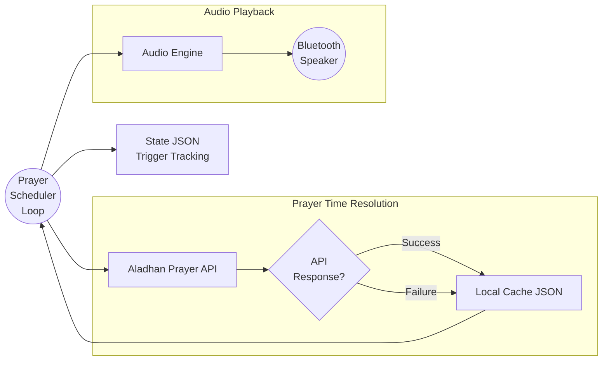

# 📢 Digital Azan – Production-Ready Prayer Automation System

A **headless, offline-safe, family-friendly Digital Azan system** built on **Raspberry Pi**.  
Designed to run **24×7 without manual intervention**, with **Bluetooth speaker support** and **full systemd integration**.

---

## ✅ Key Features

- 🔊 **Automatic Azan playback** for all daily prayers  
- 🌅 **Separate Azan for Fajr**  
- 📶 **Offline-safe** (cached prayer times)  
- 🔁 **Auto-recovers** after reboot / power loss  
- 🎧 **Bluetooth speaker support** (headless)  
- 🧹 **Automatic cleanup** of old state files  
- 🧪 **Local test mode** (Windows & Linux)  
- ⚙️ **systemd service** (true production deployment)

---

## 🧠 High-Level Architecture




---

## 🧩 Core Components

### 1️⃣ Prayer Time Client

-   Fetches prayer times from **Aladhan API**
-   Automatically follows HTTP redirects
-   Stores daily cache  ```app/cache/prayer_times_YYYY-MM-DD.json```

---

### 2️⃣ Offline Cache (Critical)

- If API fails → **cached timings are used**
- Guarantees **Azan even with no internet**
- One file per day (auto-overwritten)

---

### 3️⃣ Scheduler Engine

- Checks current time every **N seconds**
- Triggers Azan **once per prayer**
- Uses state files to prevent duplicate triggers

---

### 4️⃣ Audio Engine

- Cross-platform abstraction
- **Windows** → ```winsound```
- **Raspberry Pi** → ```mpv``` (headless, Bluetooth-safe)

---

### 5️⃣ systemd Service

- Runs automatically on boot
- Survives crashes & reboots
- No SSH or manual start required

---

## 📂 Project Structure
```text
digital_azan/
│
├── app/
│   ├── audio/          # Audio engines
│   ├── cache/          # Cached prayer times
│   ├── state/          # Trigger state files
│   ├── scheduler.py
│   ├── prayer_times.py
│   ├── azan_player.py
│   └── config.py
│
├── assets/
│   └── audio/
│       ├── azan.wav
│       └── azan_fajr.wav
│
├── scripts/
│   └── run_scheduler_local.py
│
├── config/
│   └── config.yaml
│
├── requirements.txt
└── README.md
```

---

## ⚙️ Configuration
```config/config.yaml```

```yaml
location:
  city: "Hyderabad"
  country: "India"
  method: 2

runtime:
  timezone: "Asia/Kolkata"
  check_interval_seconds: 20
  trigger_window_seconds: 90

behavior:
  prayers:
    - Fajr
    - Dhuhr
    - Asr
    - Maghrib
    - Isha

audio:
  mode: "system"
  files:
    fajr: assets/audio/azan_fajr.wav
    default: assets/audio/azan.wav
```

---

## 🔁 Change City

Just update:

- city
- country

✅ No code changes required

---


## 🧪 Test Azan (No Waiting)
```bash
python -m scripts.run_scheduler_local --test-azan
```

- ✔ Works on Windows
- ✔ Works on Raspberry Pi

---

## 🔊 Bluetooth Speaker Pairing (Headless Pi)

```bash
bluetoothctl
power on
agent on
default-agent
scan on
pair XX:XX:XX:XX:XX:XX
trust XX:XX:XX:XX:XX:XX
connect XX:XX:XX:XX:XX:XX
exit
```

**Set Bluetooth as default sink**
```bash
pactl list sinks short
pactl set-default-sink bluez_sink.XXXX
```

**Test audio**

```bash
mpv assets/audio/azan.wav
```

---

## 🕒 Time Sync Verification
```bash
timedatectl
```
Ensure:

- ```System clock synchronized: yes```
- Correct timezone

---

## 🚀 Production Deployment (systemd)

**Service File**

```bash
mkdir -p ~/.config/systemd/user
nano ~/.config/systemd/user/digital-azan.service
```

```ini
[Unit]
Description=Digital Azan Prayer Scheduler
After=pipewire.service wireplumber.service bluetooth.service

[Service]
ExecStart=/home/pi/projects/digital_azan/.venv/bin/python -m scripts.run_scheduler_local
WorkingDirectory=/home/pi/projects/digital_azan
Restart=always
Environment=PYTHONUNBUFFERED=1

[Install]
WantedBy=default.target

```

**Enable lingering (one-time)**

```bash
sudo loginctl enable-linger pi
```


**Enable & Start**

```bash
systemctl --user daemon-reload
systemctl --user enable digital-azan
systemctl --user start digital-azan
```

**Check Status**
```bash
systemctl --user status digital-azan
```


### Robust Bluetooth Auto-Reconnect Design

#### Behavior:

- Service runs at boot
- Tries to connect
- If speaker is OFF → **fails**
- systemd waits → **retries**
- When speaker turns ON → **connect succeeds**
- Service exits cleanly

script to connect to bluetooth speaker
```bash
sudo nano /usr/local/bin/bt-autoconnect.sh
```
```sh
#!/bin/bash

BT_MAC="3C:1A:CD:7D:9C:3D"
BT_SINK="bluez_sink.3C_1A_CD_7D_9C_3D.a2dp_sink"

while true; do
    # If sink already exists, ensure it's default
    if pactl list short sinks | grep -q "$BT_SINK"; then
        pactl set-default-sink "$BT_SINK"
        sleep 10
        continue
    fi

    # Try to connect speaker
    bluetoothctl connect "$BT_MAC" >/dev/null 2>&1

    # Wait for sink
    for i in {1..10}; do
        if pactl list short sinks | grep -q "$BT_SINK"; then
            pactl set-default-sink "$BT_SINK"
            break
        fi
        sleep 2
    done

    sleep 10
done
```

Make sure it’s executable:

```bash
sudo chmod +x /usr/local/bin/bt-autoconnect.sh
```

systemd service to auto-retry

```bash
sudo nano /etc/systemd/system/bt-autoconnect.service
```
```ini
[Unit]
Description=Bluetooth Speaker Monitor & Auto-Connect
After=bluetooth.service pipewire.service wireplumber.service
Wants=bluetooth.service

[Service]
Type=simple
User=pi
Environment=XDG_RUNTIME_DIR=/run/user/1000
ExecStart=/usr/local/bin/bt-autoconnect.sh
Restart=always
RestartSec=5

[Install]
WantedBy=multi-user.target
```

### Reload & enable

```bash
sudo systemctl daemon-reload
sudo systemctl enable bt-autoconnect
sudo systemctl restart bt-autoconnect
```
---

## 🧹 Automatic Cleanup

- State files older than 7 days are deleted
- Cache files are safe to keep (tiny size)

---

## 🛡️ Reliability Guarantees

| Scenario       | Result              |
| -------------- | ------------------- |
| Internet down  | Uses cached timings |
| Power cut      | Auto resumes        |
| Reboot         | systemd restarts    |
| Wi-Fi unstable | No Azan missed      |

---

## 🧠 Design Philosophy

- Azan must never depend on Wi-Fi.
- This system was designed as:
    - ❌ Not a script
    - ✅ A long-running autonomous service


